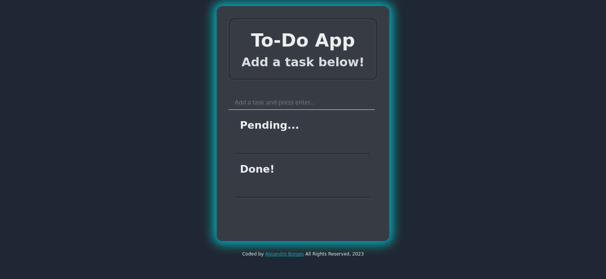

# To-Do App 

This is a To-Do tracking app made with Vanilla JavaScript.  

## Features

- Allows the user to enter as many to-dos as desired. 
- Records all to-dos completed in a single session. 
- Buttons for marking tasks completed or erase them all together. 

## Usage 

To start using this app, open the `index.html` in your browser, then add to-dos on the indicated field.  As you complete your tasks, click on the Done button to mark them completed, you can also delete them by clicking on the Delete button. 

## Screenshot 

## Credits 

This project was created by [Alejandro Borges](https://github.com/AlexdelCarmen)

## License 

This project is released under the MIT License [MIT License](./LICENSE)